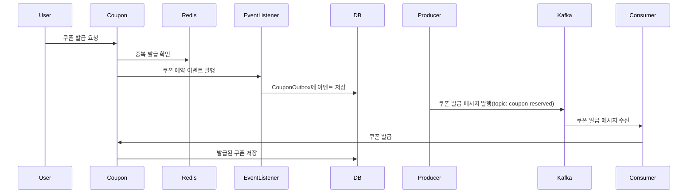

# Kafka를 이용하여 선착순 쿠폰 발급 비즈니스 프로세스 개선

## 선착순 쿠폰 발급 프로세스

1. 유저가 쿠폰 발급 요청을 하면 Redis의 발급된 userId가 들어있는 SET을 조회하여 중복 발급 방지
2. 중복되지 않은 유저임을 확인하면 SpringApplicationEvent 발행
   - BEFORE_COMMIT: CouponOutbox에 이벤트 기록(eventStatus: `INIT`)
   - AFTER_COMMIT: 카프카 메시지 발행
3. 발행된 카프카 메시지를 수신하여 쿠폰 발급 진행하고 CouponOutbox의 이벤트 상태를 `SEND_SUCCESS`로 변경
4. 주기적으로 CouponOutbox에 상태가 `INIT`인 이벤트를 조회하여 카프카 메시지 재발행

## Kafka 구성

